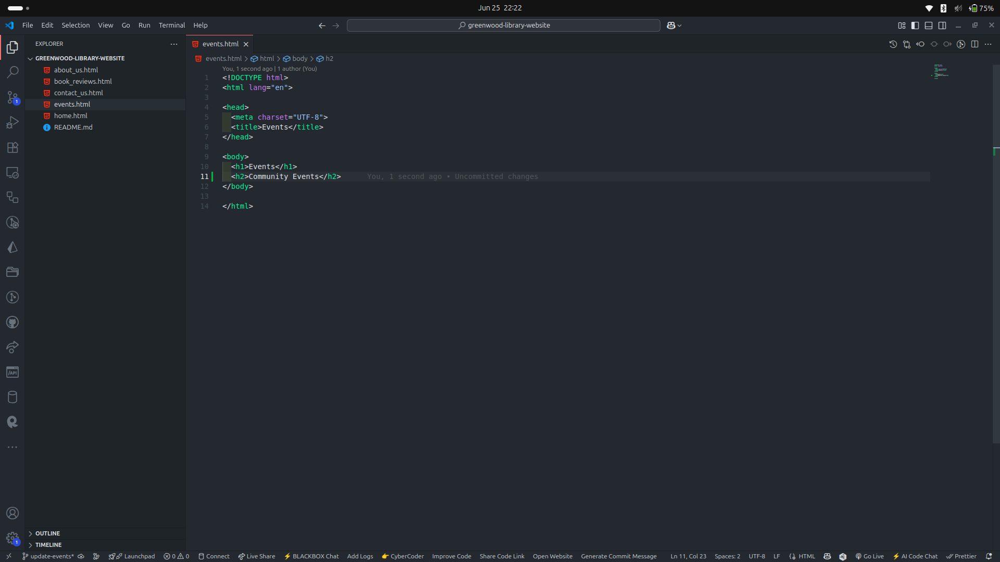

<!-- ABOUT THE PROJECT -->
## CAPSTONE PROJECT: ENHANCING A COMMUNITY LIBRARY WEBSITE

### Objective

For this project, the following steps were taken to demonstrate git workflow using Git and GitHub:

- [CAPSTONE PROJECT: ENHANCING A COMMUNITY LIBRARY WEBSITE](#capstone-project-enhancing-a-community-library-website)
  - [Objective](#objective)
    - [Create a Github Repository](#create-a-github-repository)
    - [Add web pages to the repository](#add-web-pages-to-the-repository)
    - [Morgan's Work: Adding Book Reviews](#morgans-work-adding-book-reviews)
    - [Jamie's Work: Updating Events Page](#jamies-work-updating-events-page)

----

#### Create a Github Repository

Create a public repository named "greenwood-library-website".

Clone the remote repository to your local machine.

----

#### Add web pages to the repository

Add the following pages to the repository:
-- home.html
-- about_us.html
-- events.html
-- contact_us.html

----

Stage and commit changes to the local repository. Push the pages update to the remote repository

----

#### Morgan's Work: Adding Book Reviews

A new branch (add-book-reviews) is created. 

Add a new file named book_reviews.html.

Add the changes to the local repository
The changes are staged and committed. 

Pull requests are made and merged to the remote repository.

----

#### Jamie's Work: Updating Events Page

A new branch (update-events) is created. 

Update the events.html file.

Add the changes to the local repository
The changes are staged and committed. 

Pull requests are made and merged to the remote repository.

